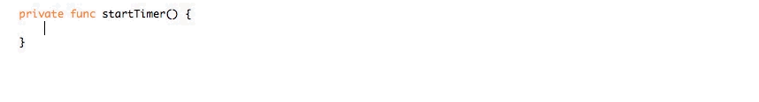
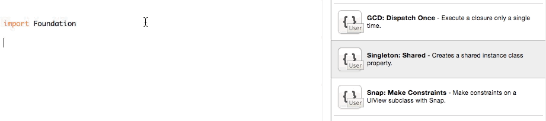

# Xcode Swift Snippets

I have slowly been collecting some useful Swift snippets and I thought it would be useful to allow others to leverage them. Feel free to pull down the repo and install away.

* Singleton Pattern
* GCD Dispatch
* [Snap](https://github.com/Masonry/Snap) Constraints

## Installing Snippets

I have provided an installation script to make it really easy to install the snippets into Xcode.

1. Open Terminal to repo location
1. execute `./install.sh`
1. Restart Xcode

## Using Snippets

Once you have run the installation script, you can use the snippets through the shortcut autocompletion or by dragging them from the Snippet library. Here is a quick example of using the `dispatch after` snippet.

#### Typing a snippet shortcut

#### Dragging it in from the snippet library

